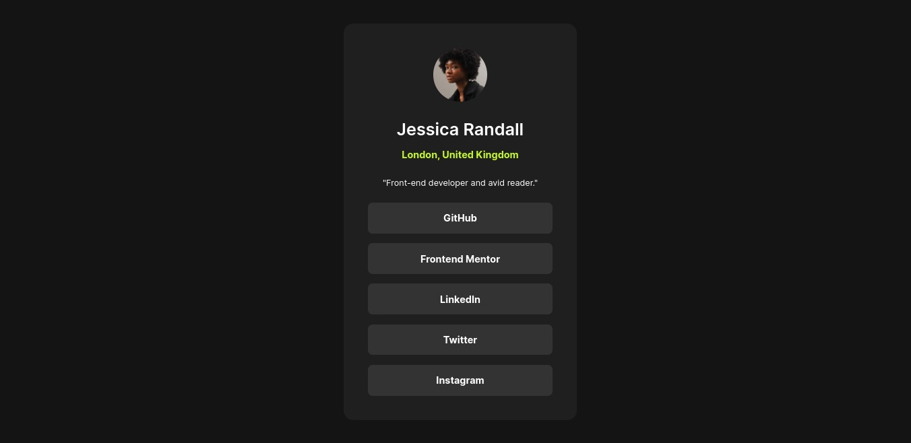

# Frontend Mentor - Social links profile solution

This is a solution to the [Social links profile challenge on Frontend Mentor](https://www.frontendmentor.io/challenges/social-links-profile-UG32l9m6dQ).

## Table of contents

- [Overview](#overview)
  - [The challenge](#the-challenge)
  - [Screenshot](#screenshot)
  - [Links](#links)
- [My process](#my-process)
  - [Built with](#built-with)
  - [What I learned](#what-i-learned)
  - [Useful resources](#useful-resources)
- [Author](#author)

## Overview

### The challenge

Users should be able to:

- See hover and focus states for all interactive elements on the page

### Screenshot

### Links

- Solution URL: [Solution link](https://github.com/larryQuao/social-links-profile.git)
- Live Site URL: [Live Link](https://social-links-profile-five-amber.vercel.app)

## My process

### Built with

- Semantic HTML5 markup
- CSS custom properties
- Flexbox

### What I learned

I learned to implement the semantic HTML to this project which makes the styling of the elements much easier. After learning and reading the best practices of semantic html. 

To see how you can add code snippets, see below:

### Useful resources

- [Resource 1](https://hackernoon.com/how-to-write-semantic-html-dkq3ulo) - This helped me understand more of semantic HTML.

## Author
- Frontend Mentor - [@larryQuao](https://www.frontendmentor.io/profile/larryQuao)
